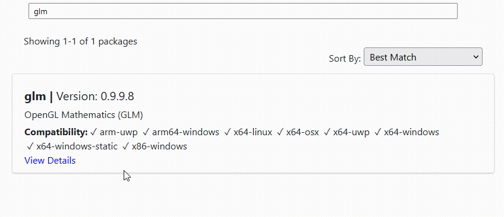

# 1. Installing & using vcpkg
<ins> About</ins> <br>

> vcpkg is a free C/C++ package manager for acquiring and managing libraries. 
Choose from over 1500 open source libraries to download and build in a single step or add
your own private libraries to simplify your build process. Maintained by the Microsoft - C++ team and open source contributors.  

 [Installing \& using vcpkg](#installing--using-vcpkg)
- [1. Installing \& using vcpkg](#1-installing--using-vcpkg)
- [2. Prerequisites -](#2-prerequisites--)
- [3. Install vcpkg](#3-install-vcpkg)
  - [3.1. Step 1: Clone the vcpkg repo](#31-step-1-clone-the-vcpkg-repo)
  - [3.2. Step 2: installing vscpkg](#32-step-2-installing-vscpkg)
  - [3.3. Step 3: Adding vscpkg command into bash](#33-step-3-adding-vscpkg-command-into-bash)
  - [3.4. \[Optional\] Step 4: add git-bash into Visual Studio](#34-optional-step-4-add-git-bash-into-visual-studio)
  - [3.5. Step 5: Add a new package](#35-step-5-add-a-new-package)
  - [3.6. Step 6: Include in your project:](#36-step-6-include-in-your-project)


          
# 2. Prerequisites -

    • Windows 7 or newer
    • Visual Studio 2015 Update 3 or newer
    • Visual Studio Code 1.20 2017 or newer
    • Git-Bash

# 3. Install vcpkg

I recommand installing globally, and placing the repo in short install path like: `C:\src\vcpkg` or `C:\dev\vcpkg`, since otherwise you may run into path issues for some port build systems.

## 3.1. Step 1: Clone the vcpkg repo

```properties
git clone https://github.com/Microsoft/vcpkg.git
```

## 3.2. Step 2: installing vscpkg

in the vscpkg open git-bash and type `.\bootstrap-vcpkg.bat`
this will install vscpkg in the folder

## 3.3. Step 3: Adding vscpkg command into bash

open git-bash, then type `code .bash_profile`

paste in the code:

```properties
#vcpkg
export PATH=$PATH:/c/ProgramData/vcpkg
```

save the file and close the editor

Adding `vcpkg` to your global commands depends on the operating system you're using. Below are the steps for both Windows and Unix-like systems (Linux/MacOS).

# add vcpkg to the PATH
### For Windows:

1. **Search for Environment Variables**: Open the Start Menu and search for "Environment Variables," then choose "Edit the system environment variables."

2. **System Properties**: In the System Properties window, click the "Environment Variables" button.

3. **Edit PATH**: Under "System variables," find the `PATH` variable and click "Edit."

4. **Add New Path**: In the Edit Environment Variable window, click "New" and add the full path to your `vcpkg` directory,`C:\src\vcpkg` or `C:\dev\vcpkg` or where you saved it on your local machine.

5. **Save and Exit**: Click "OK" on all open windows to save the changes.

6. **Restart Command Prompt**: You'll need to restart any open Command Prompt windows, or open a new one, for the changes to take effect.

### For Unix-like Systems (Linux/MacOS):

1. **Open Terminal**: Open a terminal window.

2. **Edit Profile**: Use a text editor to open your shell profile script. This is typically `~/.bashrc` for Bash and `~/.zshrc` for Zsh.

    ```bash
    nano ~/.bashrc  # For Bash
    # or
    nano ~/.zshrc  # For Zsh
    ```

3. **Add to PATH**: Add the following line to the end of the file, adjusting the path as necessary:

    ```bash
    export PATH=$PATH:/path/to/vcpkg
    ```

4. **Save and Exit**: Save the file and exit the text editor.

5. **Apply Changes**: Apply the changes to your current session:

    ```bash
    source ~/.bashrc  # For Bash
    # or
    source ~/.zshrc  # For Zsh
    ```

Now, `vcpkg` should be available as a global command in your system. You can test it by opening a new terminal window and running:

```bash
vcpkg --version
```

This should display the installed version of `vcpkg`, confirming that it's accessible globally.


## 3.4. [Optional] Step 4: add git-bash into Visual Studio

open Visual Studio 2015 Update 3 or newer, click `CTRL` + `` ` `` it will open the integrated terminal, click the cogwheel or gear icon.
make sure it open in Environment > Terminal, click `Add` and input this

```haskell
Name: Git-Bash
Shell Location: c:\program files\git\bin\bash.exe
Arguments: --login -i
```

the arguments `--login -i` will open our `code .bash_profile`

⚠️ Note -
> if you aren't using this method have a terminal open where you cloned the vcpkg open and use `./vcpkg` to use the library, this tutorial will continue as this step being made

## 3.5. Step 5: Add a new package

find a package that you want to use, in this case we going to install GLM

<details>
  <summary>Click To Read About GLM</summary>
  OpenGL Mathematics (GLM) is a C++ mathematics library for graphics software based on the OpenGL Shading Language
</details>

to install this package we will input this command

```properties
vcpkg install glm
```
you can find each package installation command by searching it in the <a href="https://vcpkg.io/en/packages.html">vcpkg website</a> and clicking on the `View Details`




by default vcpkg will install the x86 version if you want the x64 version attach `:x64-windows` in the end of the command like this

```properties
vcpkg install glm:x64-windows
```

you can choose other versions


## 3.6. Step 6: Include in your project:
after the installation of the package run the command:
```properties
vcpkg integrate install
```
this will enable the global packages to be included in your project

this is the console response 
```haskell 
Applied user-wide integration for this vcpkg root.
CMake projects should use: "-DCMAKE_TOOLCHAIN_FILE=C:/dev/vcpkg/scripts/buildsystems/vcpkg.cmake"

All MSBuild C++ projects can now #include any installed libraries. Linking will be handled automatically. Installing new libraries will make them instantly available.
```

we successfully installed and enabled vcpkg to be use in our project.

now create or go to your project, and include GLM 
```cpp
#include <glm/glm.hpp>
```
 plug in this code to make sure it's working
 ```cpp
int main()
{
    std::cout << "Hello World!\n";
	glm::vec3 a(1.0f, 0.0f, 0.0f);
}

glm::vec3 computeNormal(
    glm::vec3 const& a,
    glm::vec3 const& b,
    glm::vec3 const& c)
{
    return glm::normalize(glm::cross(c - a, b - a));
}
```

Done!


<hr>
<font size="1px">
Written by <a href="https://www.linkedin.com/in/dorz/">Dor Zairi<a>

for further documentation refer to <a href="https://vcpkg.io/en/docs/README.html"> vcpkg docs</a>
</font>
